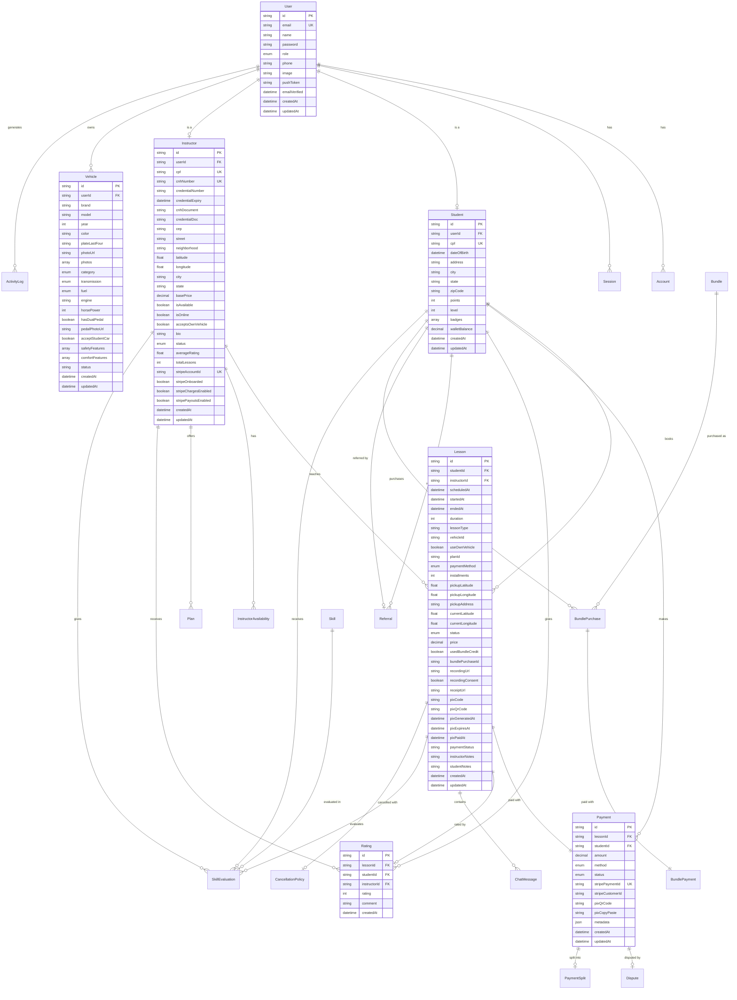
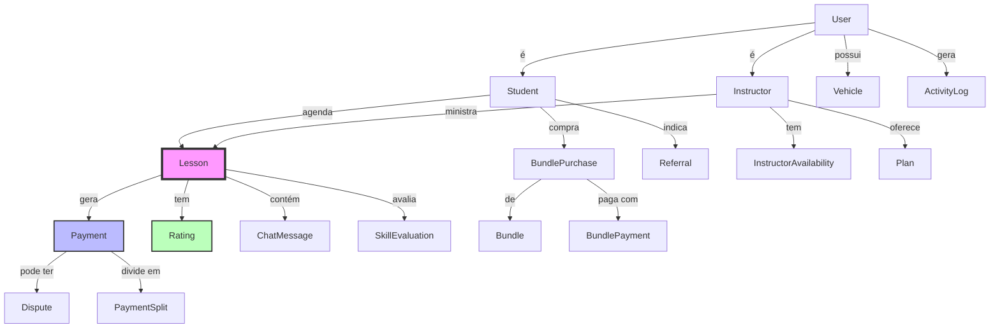
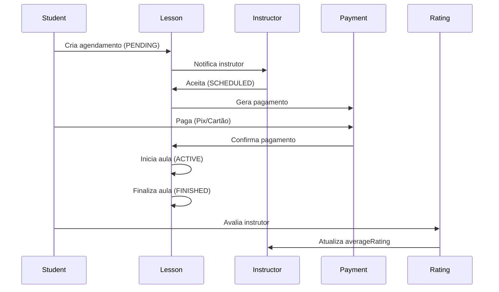
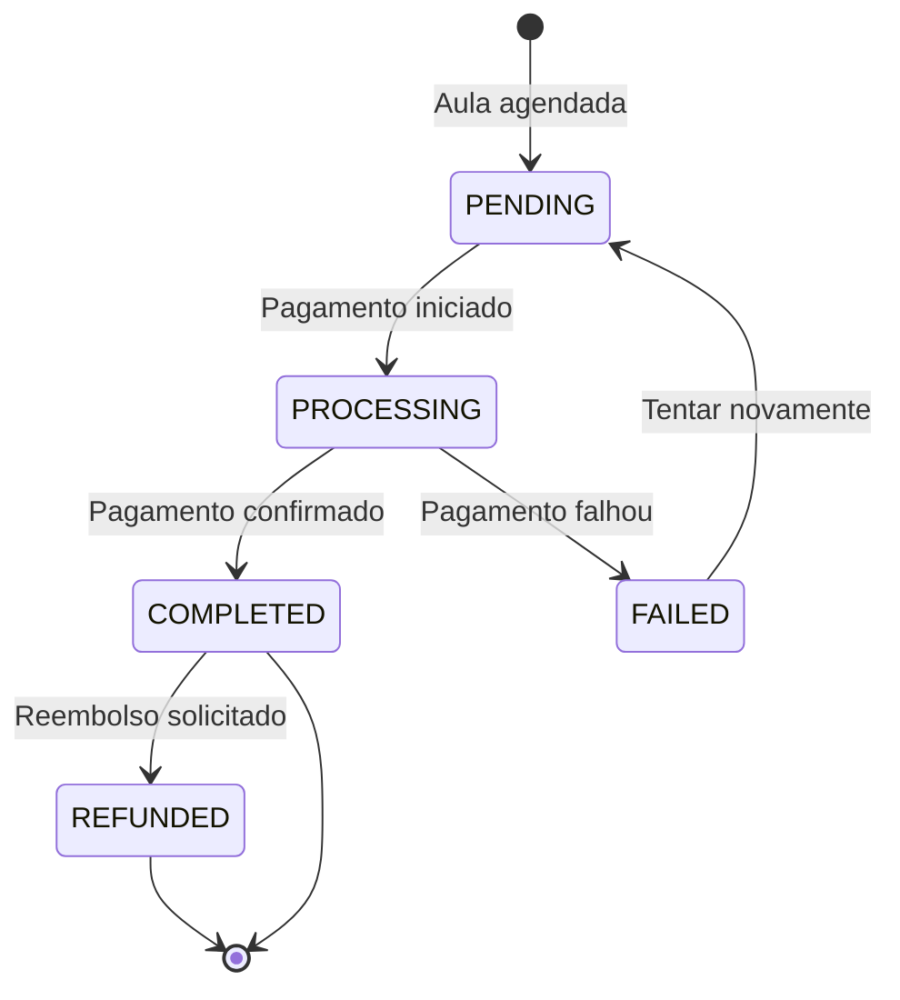
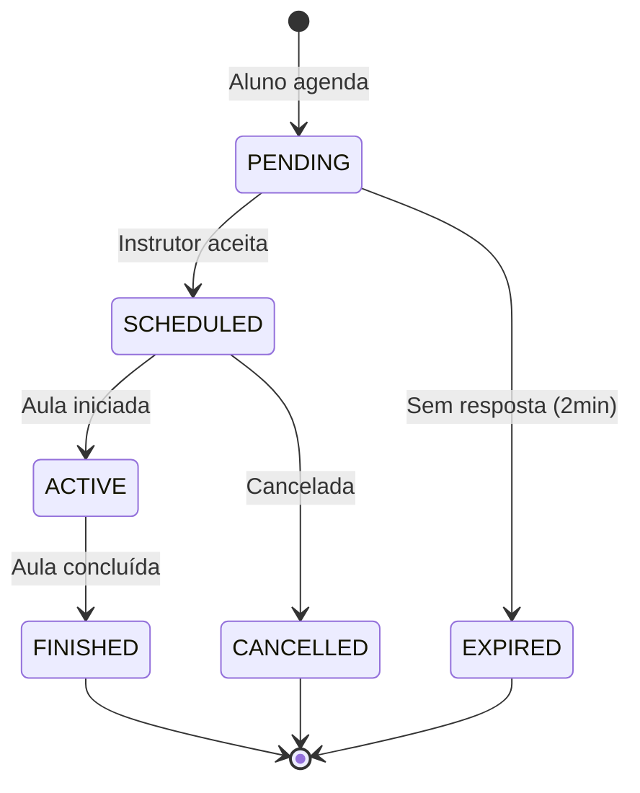
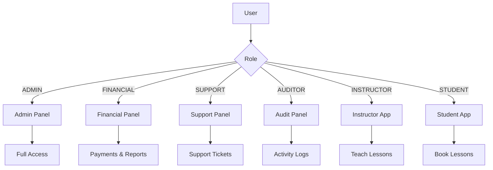
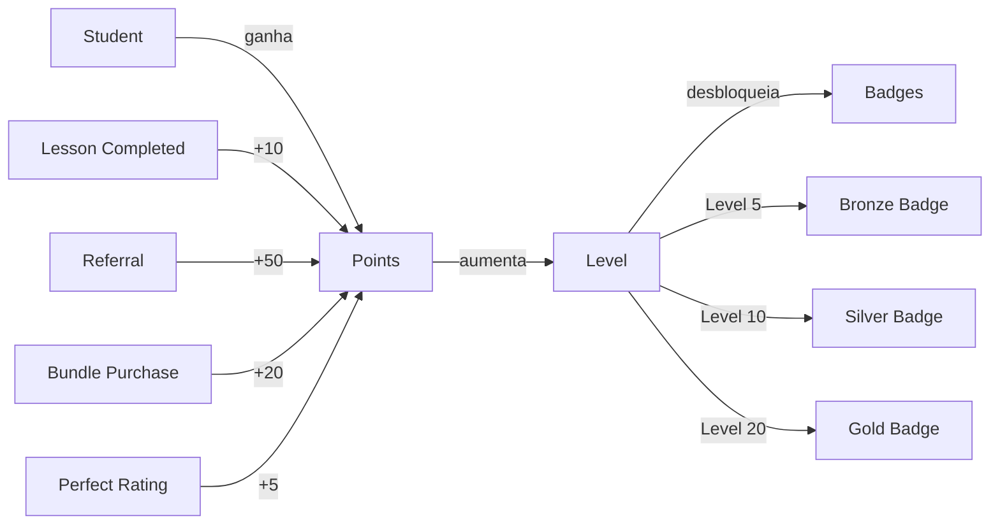
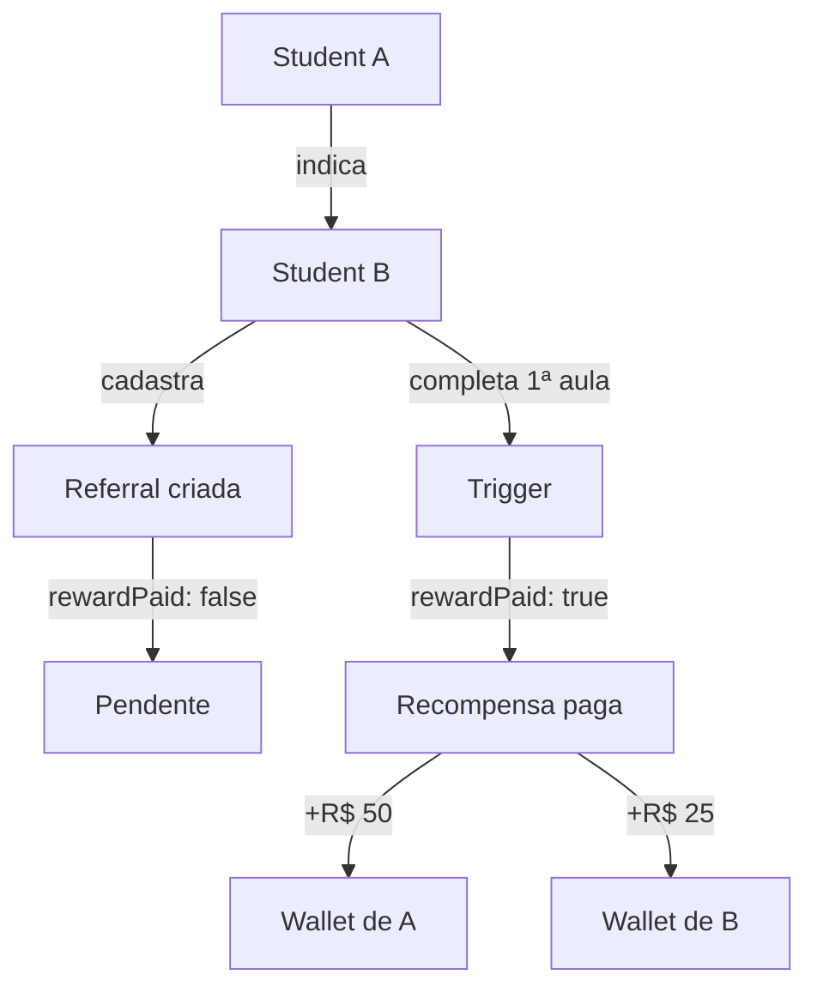
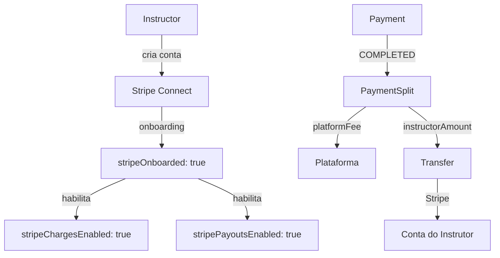
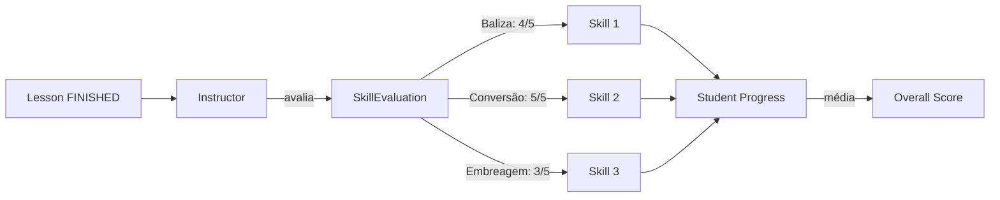

# 📊 Diagrama ER - Sistema Bora

## Diagrama de Relacionamentos (Mermaid)

## Diagrama Simplificado (Fluxo Principal)

## Fluxo de Agendamento de Aula

## Fluxo de Pagamento

## Status de Aula

## Hierarquia de Usuários

## Gamificação do Aluno

## Sistema de Indicação

## Integração Stripe

## Avaliação de Skills

---

**Como visualizar:**
1. Copie o código Mermaid
2. Cole em: https://mermaid.live
3. Ou use extensões VSCode/GitHub que suportam Mermaid

---

**Desenvolvido com ❤️ para Bora Platform**
