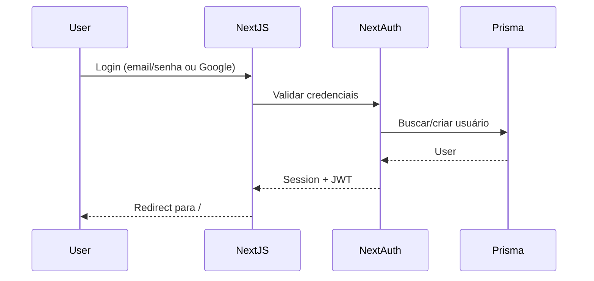
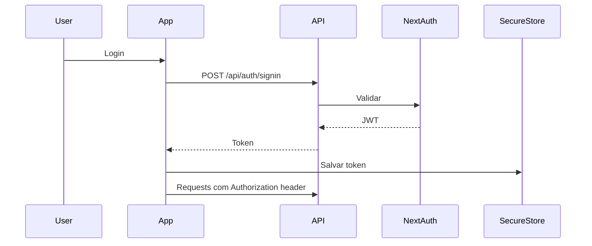
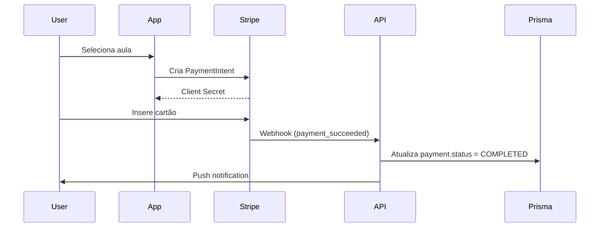
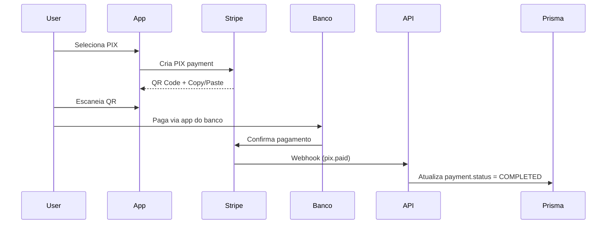

# 🏗️ Arquitetura - BORA

Documentação técnica da arquitetura do projeto.

## 📐 Visão Geral

BORA é um monorepo Turborepo que segue uma arquitetura modular com separação clara entre:

- **Frontend (Web)**: Next.js 15 com App Router
- **Frontend (Mobile)**: React Native + Expo Router
- **Backend**: tRPC + Prisma + Supabase
- **Autenticação**: NextAuth
- **Pagamentos**: Stripe

## 🎯 Decisões Arquiteturais

### Monorepo vs Polyrepo

**Escolha: Monorepo (Turborepo)**

Vantagens:

- Code sharing facilitado entre apps
- Build cache compartilhado
- Versionamento único
- Refactoring mais fácil
- CI/CD simplificado

### tRPC vs REST vs GraphQL

**Escolha: tRPC**

Vantagens:

- Type-safety end-to-end
- Sem code generation
- Performance superior (batching)
- DX excelente
- Integração nativa com React Query

### Prisma vs TypeORM vs Drizzle

**Escolha: Prisma**

Vantagens:

- Schema declarativo
- Migrations automáticas
- Type-safety completo
- Studio para debug
- Ecossistema maduro

### NextAuth vs Clerk vs Supabase Auth

**Escolha: NextAuth**

Vantagens:

- Open-source
- Flexível (credentials + OAuth)
- Integração direta com Prisma
- Self-hosted (controle total)

## 📦 Estrutura de Packages

### `@bora/ui`

Biblioteca de componentes baseada em shadcn/ui com tokens BORA.

**Exports:**

- Componentes base (Button, Card, Input, etc.)
- Tokens CSS
- Utilidades (cn, etc.)

**Consumers:**

- web-admin
- web-site

### `@bora/db`

Cliente Prisma + schema único para todos os apps.

**Exports:**

- Prisma Client configurado
- Types do schema
- Enums

**Consumers:**

- @bora/api
- @bora/auth
- apps (diretamente)

### `@bora/api`

Routers tRPC com lógica de negócio.

**Routers:**

- `user`: Gestão de usuários
- `lesson`: CRUD de aulas
- `instructor`: Gestão de instrutores
- `payment`: Pagamentos e disputas

**Middlewares:**

- `isAuthenticated`: Verifica sessão
- `hasRole`: Verifica permissão por role

**Consumers:**

- web-admin (tRPC client)
- apps mobile (tRPC client)

### `@bora/auth`

Configuração centralizada do NextAuth.

**Providers:**

- Credentials (email/senha)
- Google OAuth

**Consumers:**

- web-admin
- apps mobile (via JWT)

### `@bora/i18n`

Traduções centralizadas (pt-BR inicial).

**Consumers:**

- Todos os apps

## 🔐 Fluxo de Autenticação

### Web (NextAuth)

### Mobile (JWT + SecureStore)

## 💳 Fluxo de Pagamento

### Cartão de Crédito

### PIX (Stripe BR)

## 🗺️ Fluxo de Aula

### Agendamento

1. Aluno busca instrutores próximos (geolocalização)
2. Seleciona instrutor e horário
3. Cria `Lesson` com status `SCHEDULED`
4. Cria `Payment` com status `PENDING`
5. Processa pagamento
6. Notifica instrutor (push)

### Durante a Aula

1. Instrutor aceita corrida
2. Atualiza `Lesson.status = ACTIVE`
3. Atualiza `Lesson.startedAt = now()`
4. Compartilha localização em tempo real (WebSocket/Pusher)
5. Finaliza aula
6. Atualiza `Lesson.status = FINISHED`
7. Calcula `Lesson.duration`

### Pós-Aula

1. Aluno avalia instrutor (cria `Rating`)
2. Atualiza `Instructor.averageRating`
3. Incrementa `Instructor.totalLessons`
4. Gamificação: adiciona pontos ao `Student.points`

## 📊 Modelo de Dados

### Principais Entidades

- **User**: Conta única (email, role)
- **Student**: Perfil de aluno (1:1 com User)
- **Instructor**: Perfil de instrutor (1:1 com User)
- **Lesson**: Aula (N:1 Student, N:1 Instructor)
- **Payment**: Pagamento (1:1 Lesson)
- **Rating**: Avaliação (1:1 Lesson)

### Roles

- `ADMIN`: Acesso total ao painel admin
- `FINANCIAL`: Visualiza pagamentos/disputas
- `SUPPORT`: Visualiza usuários/aulas
- `AUDITOR`: Read-only em tudo
- `INSTRUCTOR`: App instrutor
- `STUDENT`: App aluno

## 🚀 Deploy

### Web Apps (Vercel)

- `web-admin`: vercel.com/admin
- `web-site`: vercel.com

Build automático via GitHub Actions no push para `main`.

### Mobile Apps (Expo EAS)

- `app-aluno`: Play Store + App Store
- `app-instrutor`: Play Store + App Store

Build via `eas build` no push para `main`.

### Database (Supabase)

- Postgres hospedado no Supabase
- Migrations via Prisma
- Backups automáticos

## 🔒 Segurança

### Rate Limiting

- 100 req/min por IP (Upstash Redis)
- 10 req/min por sessão em mutations

### Validação

- Zod em todas as entradas tRPC
- Prisma sanitiza SQL (prepared statements)

### Uploads

- Presigned URLs (S3/Supabase)
- Limite 5MB
- Whitelist de MIME types
- Scan de vírus (opcional: ClamAV)

### Dados Sensíveis

- CNH/credenciais: AES-256 antes de salvar
- Logs de acesso em tabela separada
- LGPD: endpoint de exclusão de dados

## 📈 Observabilidade

### Logging

- OpenTelemetry
- Grafana Cloud (free tier)
- Traces de performance

### Métricas

- GMV em tempo real
- Taxa de conversão
- NPS
- Uptime

### Alertas

- Slack/Discord via webhooks
- Erro crítico > 5min
- Uptime < 99%

## 🧪 Testes

### Unitários (Vitest)

- Routers tRPC
- Utilidades
- Componentes React

### Integração

- Fluxo completo de agendamento
- Fluxo de pagamento (mock Stripe)

### E2E (Playwright)

- Happy path: aluno agenda aula
- Happy path: instrutor aceita aula
- Admin aprova instrutor

## 📚 Referências

- [Turborepo Docs](https://turbo.build/repo/docs)
- [tRPC Docs](https://trpc.io)
- [Next.js 15 Docs](https://nextjs.org/docs)
- [Expo Router Docs](https://docs.expo.dev/router/introduction/)
- [Prisma Docs](https://www.prisma.io/docs)
